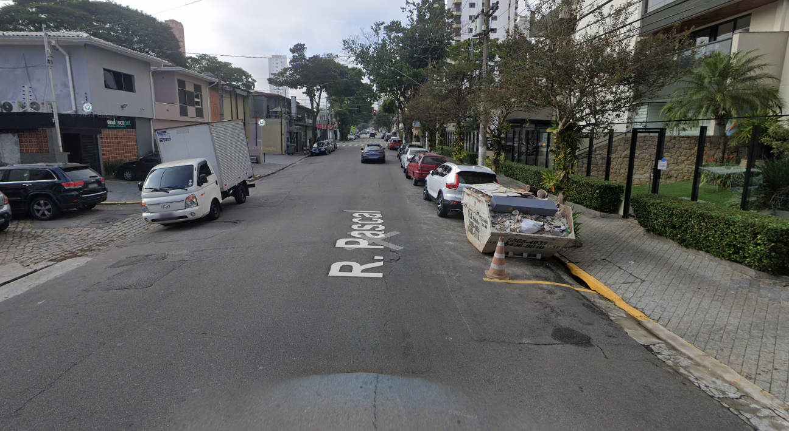

## Sidewalk-DepthAnything

O objetivo principal desse projeto é estimar qualidades de calçadas analisadas por imagens do
google maps.

Essa projeto utiliza duas bibliotecas principais para fazer os cálculos, detectron2,
para reconhecer padrões, como árvores, ruas, carros, e o caso mais importante do
projeto, calçadas. E também o depthanything, que estima a profundidade e largura
de cada pixel da imagem, baseado no quão distante ela está da câmera.

## Como rodar o projeto

Existe um arquivo chamado sidewalkcolab.ipynb, na camada principal do projeto.
Esse arquivo pode ser rodado em um ambiente com jupyter, ou no google colab,
por exemplo. 

Dentro desse arquivo, existem instruções para rodar o programa de forma sequencial,
para garantir que as exigências sejam cumpridas.

## Como funciona

Primeiramente, o sistema de reconhecimento de imagem identifica a calçada, que
posssui um id único que servirá para a realização dos cálculos. A imagem
é dividida ao meio, para que seja calculada as distâncias dos valores
da esquerda e da direita.

Logo em seguida, o algoritmo de profundidade calcula a distância de cada pixel,
atribuindo valores a cada linha da imagem, tanto para o lado esquerdo quanto
para o direito

Como os valores calculados para cada pixel é muito variável, é feito um cálculo
que valoriza mais os pixels que estão mais perto da tela, pois eles tem mais chances
de estarem precisos. E então, a média e a mediana são calculadas para estimar a
distância da calçada

## Resultados

*Os valores calculados estão estimados em centímetros*

    
    

- Média direita: 256.15
- Mediana direita: 291.45
- Média esquerda: 133.48
- Mediana esquerda: 99.98

    
    

- Média direita: 305.95
- Mediana direita: 284.87
- Média esquerda: 232.93
- Mediana esquerda: 248.18

    
    

- Média direita: 228.08
- Mediana direita: 235.26
- Média esquerda: nan
- Mediana esquerda: nan

    
    

- Média direita: 128.63
- Mediana direita: 133.87
- Média esquerda: 155.14
- Mediana esquerda: 155.52

    
    

- Média direita: 137.99
- Mediana direita: 159.87
- Média esquerda: 276.05
- Mediana esquerda: 275.79